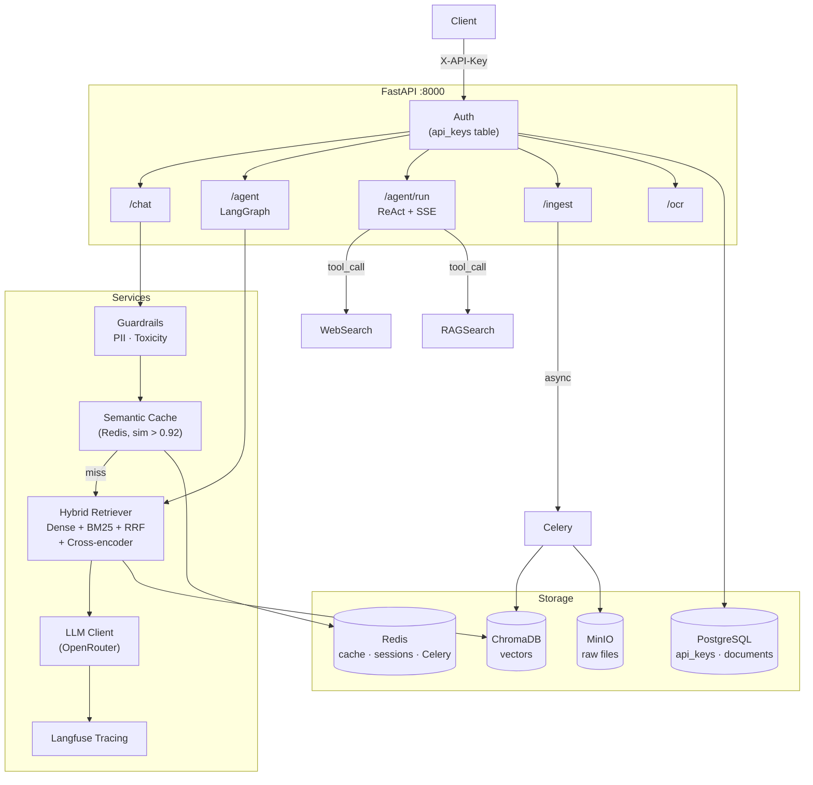

# rag-agent

> Production-ready RAG + AI Agent platform — FastAPI · LangGraph · OpenRouter · ChromaDB

[](https://github.com/SeydinaBANE/rag-agent/actions/workflows/ci.yml)
[](https://github.com/SeydinaBANE/rag-agent/actions/workflows/cd.yml)
[](https://codecov.io/gh/SeydinaBANE/rag-agent)
[](https://www.python.org/)
[](https://fastapi.tiangolo.com/)
[](LICENSE)

## Quickstart

```bash
cp .env.example .env        # add your OPENROUTER_API_KEY
make install                # install deps + pre-commit hooks
make up                     # start all services (Docker)
make migrate                # create DB schema
uv run rag-agent create-key mykey   # create first API key
make dev                    # FastAPI on :8000  →  /docs for Swagger
```

## Architecture



## API

All endpoints require `X-API-Key` header. See [docs/api.md](docs/api.md) for full request/response reference.

| Endpoint | Method | Description |
|---|---|---|
| `/api/v1/chat` | POST | RAG question answering |
| `/api/v1/chat/stream` | GET | Streaming SSE tokens |
| `/api/v1/agent` | POST | LangGraph agent (grade → web fallback → hallucination check) |
| `/api/v1/agent/run` | POST | ReAct multi-step agent (sync) |
| `/api/v1/agent/run/stream` | GET | ReAct agent with SSE step-by-step |
| `/api/v1/agent/run/sessions/{id}` | GET | Session history |
| `/api/v1/agent/run/sessions/{id}` | DELETE | Clear session |
| `/api/v1/ingest/file` | POST | Upload PDF/DOCX/TXT (async, max 50 MB) |
| `/api/v1/ingest/text` | POST | Ingest raw text |
| `/api/v1/jobs/{id}` | GET | Celery task status |
| `/api/v1/ocr` | POST | Image → structured JSON extraction |
| `/api/v1/ocr/schemas` | GET | List supported document types |
| `/api/v1/keys` | POST | Create API key |
| `/api/v1/keys` | GET | List active keys |
| `/api/v1/keys/{id}` | DELETE | Revoke key |
| `/health` | GET | Health check |
| `/metrics` | GET | Prometheus metrics |
| `/docs` | GET | Swagger UI (dev only) |

## Services

| Service | URL | Credentials |
|---|---|---|
| FastAPI | http://localhost:8000 | — |
| ChromaDB | http://localhost:8001 | — |
| MinIO Console | http://localhost:9001 | minioadmin / minioadmin |
| Langfuse | http://localhost:3000 | — |
| Grafana | http://localhost:3001 | admin / admin |
| n8n | http://localhost:5678 | admin / admin |
| Prometheus | http://localhost:9090 | — |

## Key commands

```bash
make test-unit        # fast unit tests (no Docker)
make test             # full suite with coverage (min 80%)
make lint             # ruff + mypy strict
make format           # ruff format + autofix
make eval             # Ragas quality evaluation (requires qa_dataset.json)
make eval-ocr         # OCR accuracy eval → reports/ocr_eval_latest.json
make load             # Locust load test (10 users, 30s)
make worker           # Celery worker (required for async ingest)
make dashboard        # Streamlit admin UI on :8501
make clean            # remove __pycache__, caches, htmlcov
```

## Documentation

- [docs/api.md](docs/api.md) — full API reference with request/response examples
- [docs/finetune.md](docs/finetune.md) — fine-tuning guide (LoRA/QLoRA via Unsloth)
- [docs/bruno/](docs/bruno/) — Bruno API collection for manual endpoint testing
