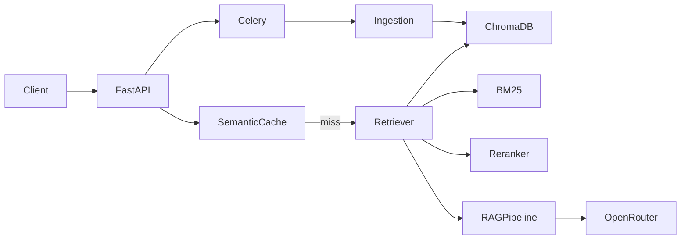

# rag-agent

> Production-ready RAG + AI Agent platform — FastAPI · LangGraph · OpenRouter · ChromaDB

[](https://github.com/baneseydina/rag-agent/actions/workflows/ci.yml)

## Quickstart

```bash
cp .env.example .env        # add your OPENROUTER_API_KEY
make install                # install deps + pre-commit hooks
make up                     # start all services (Docker)
make migrate                # run DB migrations
make dev                    # FastAPI on :8000
```

## Architecture



## API

| Endpoint | Method | Description |
|---|---|---|
| `/api/v1/chat` | POST | Q&A with RAG |
| `/api/v1/chat/stream` | GET | Streaming SSE |
| `/api/v1/ingest/file` | POST | Upload document |
| `/api/v1/ingest/text` | POST | Ingest raw text |
| `/api/v1/jobs/{id}` | GET | Job status |
| `/health` | GET | Health check |
| `/metrics` | GET | Prometheus metrics |
| `/docs` | GET | Swagger UI (dev only) |
